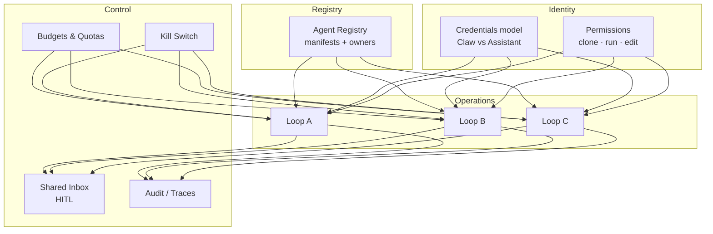

# Fleet Engineering

<p align="center">
  <a href="https://github.com/cobusgreyling/fleet-engineering/actions/workflows/audit.yml"></a>
  <a href="https://www.npmjs.com/package/@cobusgreyling/fleet-audit"></a>
  <a href="https://www.npmjs.com/package/@cobusgreyling/fleet-init"></a>
  <a href="https://www.npmjs.com/package/@cobusgreyling/fleet-budget"></a>
  <a href="https://www.npmjs.com/package/@cobusgreyling/fleet-cost"></a>
  <a href="https://github.com/cobusgreyling/fleet-engineering/blob/main/LICENSE"></a>
  <a href="https://cobusgreyling.github.io/fleet-engineering/"></a>
</p>

<p align="center">
  
</p>

**Fleet engineering is replacing ad-hoc populations of agents with an accountable organization. You design the registry, identity, permissions, inbox, audit trail, and sovereign control that let many loops run safely across a team.**

A fleet is not "many agents." A fleet is a **governed population** where every action answers one sentence:

> *Which agent did it, with what authority, against what task, evidenced by what?*

<p align="center">
  <strong><a href="https://cobusgreyling.github.io/fleet-engineering/">→ cobusgreyling.github.io/fleet-engineering</a></strong>
  <br>
  <strong><a href="https://cobusgreyling.substack.com/">→ Fleet Engineering essay on Substack</a></strong>
</p>

## Start here (pick your pain)

| Symptom | Start with |
|---------|------------|
| "We have agents everywhere" | [Team Agent Registry](patterns/team-agent-registry.md) |
| Agents act without oversight | [Shared Inbox HITL](patterns/shared-inbox-hitl.md) |
| Token bill surprise | [Fleet Budget Guard](patterns/fleet-budget-guard.md) |
| "Who did this?" in an incident | [Cross-Agent Audit](patterns/cross-agent-audit.md) |
| Already have loops | [Fleet + Loop starter](starters/fleet-plus-loop/) |

Unsure? Use the [Pattern Picker](docs/pattern-picker.md).

## The Stack

| Layer | Unit of design | Question |
|-------|----------------|----------|
| [Context Engineering](https://cobusgreyling.medium.com/context-engineering-a34fd80ccc26) | One inference | What does the model see? |
| [Harness Engineering](https://cobusgreyling.substack.com/p/the-rise-of-ai-harness-engineering) | One agent run | How does a single run execute safely? |
| [Loop Engineering](https://github.com/cobusgreyling/loop-engineering) | One autonomous system | What keeps prompting and verifying over time? |
| **Fleet Engineering** | Many agents + loops | How do populations coordinate and govern at scale? |

## Quick Links

| Start here | Description |
|------------|-------------|
| [Concepts](docs/concepts.md) | Fleet vs loop vs harness — **read this first** |
| [Assistant vs Claw](https://github.com/cobusgreyling/assistant-vs-claw) | Runnable identity models (on-behalf-of vs fixed credentials) |
| [Maturity Model](docs/maturity-model.md) | F0–F3 phased rollout |
| [Five Concerns](docs/five-concerns.md) | Topology, choreography, identity, economics, sovereign control |
| [Accountability Test](docs/accountability-test.md) | The one-sentence standard for real fleets |
| [Pattern Picker](docs/pattern-picker.md) | Which fleet pattern to adopt first |
| [Failure Modes](docs/failure-modes.md) | Incident-style catalog |
| [Primitives Matrix](docs/primitives-matrix.md) | DIY vs LangSmith vs Cursor vs Claude Code vs Grok |
| [Fleet vs Frameworks](docs/fleet-vs-frameworks.md) | Governance vs LangGraph / CrewAI |
| [Fleet Design Checklist](docs/fleet-design-checklist.md) | Ship readiness rubric (F0–F3) |
| [Patterns](patterns/README.md) | 6 production fleet patterns |
| [Starters](starters/) | Clone-and-run kits + GitHub template |
| [Examples](examples/) | Runnable DIY / LangSmith / OpenHermit walkthroughs |
| [fleet-audit](tools/fleet-audit/) | `npx @cobusgreyling/fleet-audit` |
| [fleet-init](tools/fleet-init/) | `npx @cobusgreyling/fleet-init` |
| [fleet-budget](tools/fleet-budget/) | `npx @cobusgreyling/fleet-budget` |
| [fleet-cost](tools/fleet-cost/) | `npx @cobusgreyling/fleet-cost` |
| [Stories](stories/) | Real wins and honest failures |

## Getting Started (5 minutes)

```bash
# 1. Scaffold fleet + optional loop layer
npx @cobusgreyling/fleet-init ~/my-fleet --pattern team-agent-registry --with-loop daily-triage

# 2. Audit readiness (schema + shadow-agent checks)
npx @cobusgreyling/fleet-audit ~/my-fleet --suggest

# 3. Roll up caps and attribute spend
npx @cobusgreyling/fleet-budget ~/my-fleet
npx @cobusgreyling/fleet-cost ~/my-fleet

# 4. Start F1: registry + permissions only — no unattended L2+ loops
```

**GitHub template:** enable "Template repository" in repo settings, then [Use minimal-fleet template](https://github.com/cobusgreyling/fleet-engineering/generate).

From a clone:

```bash
git clone https://github.com/cobusgreyling/fleet-engineering.git
cd fleet-engineering && npm install && npm test
node tools/fleet-init/cli.js /tmp/fleet-demo --pattern team-agent-registry
```

Phased rollout: **F0 ad-hoc → F1 catalog + inbox → F2 shared agents + budgets → F3 enterprise governance**

## The Seven Fleet Primitives

| Primitive | Job in the Fleet |
|-----------|------------------|
| **Registry** | What agents exist, who owns them, version, lifecycle |
| **Identity & credentials** | Claw (service) vs assistant (act-as-user) |
| **Permissions & sharing** | clone / run / edit; workspace vs individual |
| **Inbox / escalation** | Fleet-wide HITL; approve/reject across agents |
| **Observability & audit** | Traces, decision evidence, cross-agent search |
| **Economics** | Budgets, quotas, cost attribution per agent/team |
| **Sovereign control** | Kill switch, rollback, autonomy tiers |

Full detail: [docs/primitives.md](docs/primitives.md) · Cross-platform matrix: [docs/primitives-matrix.md](docs/primitives-matrix.md)

### Anatomy of a Fleet (Mermaid)



## Patterns

| Pattern | Scale | Starter | Week 1 | Cost risk |
|---------|-------|---------|--------|-----------|
| [Team Agent Registry](patterns/team-agent-registry.md) | 3–20 agents | [minimal-fleet](starters/minimal-fleet) | **F1** catalog only | Low |
| [Shared Inbox HITL](patterns/shared-inbox-hitl.md) | 2+ active agents | [minimal-fleet](starters/minimal-fleet) | F1 approve-only | Low |
| [Hierarchical Delegation](patterns/hierarchical-delegation.md) | manager + workers | [minimal-fleet](starters/minimal-fleet) | F1 report chain | Medium |
| [Agent Clone & Fork](patterns/agent-clone-fork.md) | 1 → many teams | [minimal-fleet](starters/minimal-fleet) | F1 clone policy | Low |
| [Fleet Budget Guard](patterns/fleet-budget-guard.md) | any active fleet | [minimal-fleet](starters/minimal-fleet) | **F1** caps only | Low |
| [Cross-Agent Audit](patterns/cross-agent-audit.md) | compliance / incidents | [minimal-fleet](starters/minimal-fleet) | F1 read-only audit | Low |

Machine-readable index: [patterns/registry.yaml](patterns/registry.yaml)

## Operating & Safety

* [Failure Modes](docs/failure-modes.md) — incident-style catalog
* [Multi-Fleet Coordination](docs/multi-fleet.md) — when teams run separate fleets
* [Operating Fleets](docs/operating-fleets.md) — cost, logging, when to kill
* [Safety](docs/safety.md) — autonomy tiers, denylist, kill switches
* [Security](SECURITY.md) — reporting and fleet-scale automation risks
* [Stack](docs/stack.md) — context → harness → loop → fleet trail

## Related Repos

* [loop-engineering](https://github.com/cobusgreyling/loop-engineering) — the layer below: autonomous loops that prompt your agents
* [awesome-harness-engineering](https://github.com/ai-boost/awesome-harness-engineering) — harness primitives and curated resources

## Contributing

Share production patterns, platform mappings, and failure stories. See [CONTRIBUTING.md](CONTRIBUTING.md).

## License

MIT

---

*Practical, platform-aware reference for fleet engineering — patterns you can clone, checklists you can ship against, and stories that include what broke.*